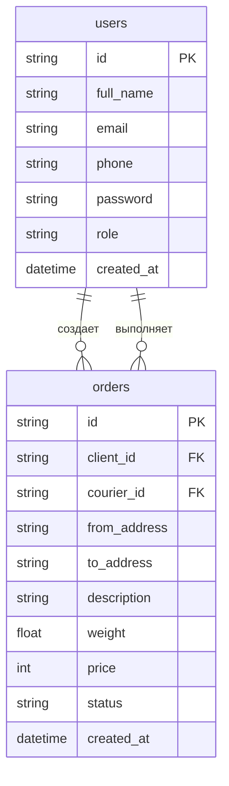

# Архитектура базы данных проекта DostavMe

## Общая информация
- **Тип БД**: SQLite
- **Версия**: 1
- **Имя БД**: DostavMe.db

## Таблицы

### 1. Таблица users
```sql
CREATE TABLE users (
    id TEXT PRIMARY KEY,
    full_name TEXT,
    email TEXT UNIQUE,
    phone TEXT UNIQUE,
    password TEXT,
    role TEXT,
    created_at DATETIME DEFAULT CURRENT_TIMESTAMP
)
```

**Поля:**
- `id` - уникальный идентификатор пользователя
- `full_name` - полное имя пользователя
- `email` - email пользователя (уникальный)
- `phone` - телефон пользователя (уникальный)
- `password` - хешированный пароль
- `role` - роль пользователя (client/courier)
- `created_at` - дата создания записи

### 2. Таблица orders
```sql
CREATE TABLE orders (
    id TEXT PRIMARY KEY,
    client_id TEXT,
    courier_id TEXT,
    from_address TEXT,
    to_address TEXT,
    description TEXT,
    weight REAL,
    price INTEGER,
    status TEXT,
    created_at DATETIME DEFAULT CURRENT_TIMESTAMP,
    FOREIGN KEY(client_id) REFERENCES users(id),
    FOREIGN KEY(courier_id) REFERENCES users(id)
)
```

**Поля:**
- `id` - уникальный идентификатор заказа
- `client_id` - ID клиента (внешний ключ)
- `courier_id` - ID курьера (внешний ключ)
- `from_address` - адрес отправления
- `to_address` - адрес доставки
- `description` - описание заказа
- `weight` - вес посылки
- `price` - стоимость доставки
- `status` - статус заказа (new/in_progress/completed)
- `created_at` - дата создания заказа

## Связи между таблицами



## Индексы
1. Таблица users:
   - PRIMARY KEY (id)
   - UNIQUE INDEX (email)
   - UNIQUE INDEX (phone)

2. Таблица orders:
   - PRIMARY KEY (id)
   - FOREIGN KEY (client_id)
   - FOREIGN KEY (courier_id)

## Основные операции

### Пользователи
- Создание нового пользователя
- Получение пользователя по ID
- Получение пользователя по телефону
- Обновление данных пользователя
- Удаление пользователя

### Заказы
- Создание нового заказа
- Получение заказа по ID
- Получение списка заказов клиента
- Получение списка заказов курьера
- Обновление статуса заказа
- Назначение курьера на заказ
- Завершение заказа

## Обработка ошибок
- Проверка уникальности email и телефона
- Проверка существования пользователя
- Проверка статуса заказа при обновлении
- Проверка прав доступа при операциях с заказами

## Миграции
При обновлении версии базы данных:
1. Создаются временные таблицы
2. Сохраняются данные из старых таблиц
3. Создаются новые таблицы
4. Восстанавливаются данные
5. Удаляются временные таблицы 