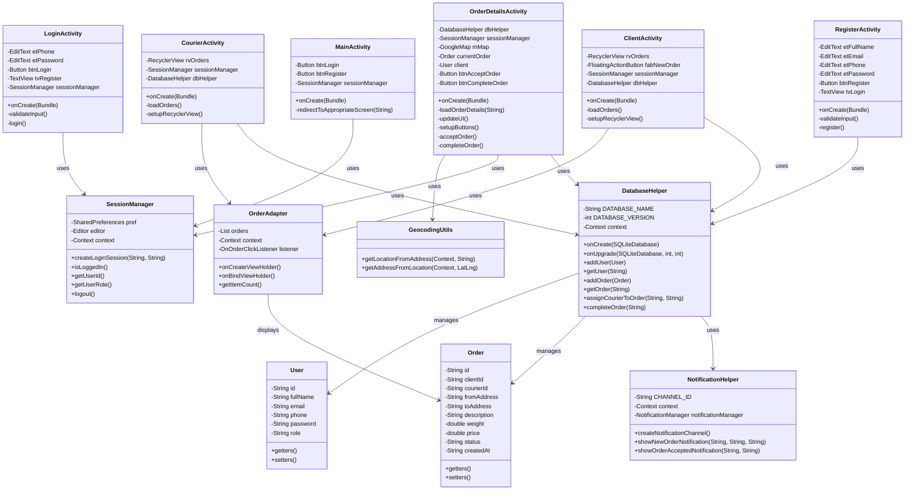

# UML Диаграмма Java-классов проекта DostavMe

## Описание компонентов

### Активности
- **MainActivity** - главный экран приложения
- **LoginActivity** - экран входа
- **RegisterActivity** - экран регистрации
- **ClientActivity** - главный экран клиента
- **CourierActivity** - главный экран курьера
- **OrderDetailsActivity** - экран деталей заказа

### Вспомогательные классы
- **DatabaseHelper** - работа с базой данных
- **NotificationHelper** - работа с уведомлениями
- **SessionManager** - управление сессией пользователя
- **GeocodingUtils** - работа с геокодированием

### Модели данных
- **Order** - модель заказа
- **User** - модель пользователя

### Адаптеры
- **OrderAdapter** - адаптер для отображения списка заказов

### Основные связи
- Активности используют SessionManager для управления сессией
- Активности используют DatabaseHelper для работы с данными
- DatabaseHelper управляет объектами Order и User
- OrderAdapter отображает данные Order
- OrderDetailsActivity использует GeocodingUtils для работы с адресами
- DatabaseHelper использует NotificationHelper для отправки уведомлений

### Основные функции
- Аутентификация и авторизация пользователей
- Управление заказами (создание, принятие, завершение)
- Отображение списков заказов
- Работа с картами и геолокацией
- Отправка уведомлений
- Управление сессией пользователя 