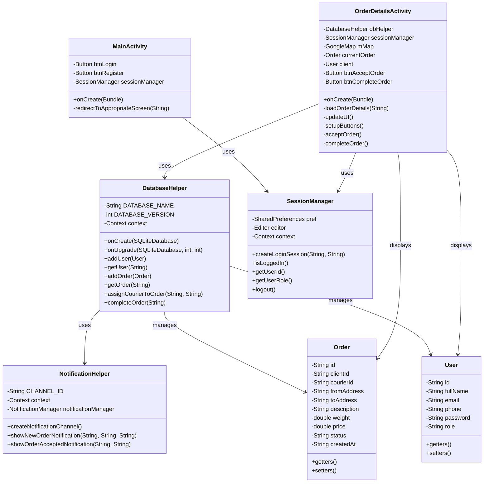

# UML Диаграмма классов проекта DostavMe

## Описание компонентов

### Активности
- **MainActivity** - главный экран приложения
- **OrderDetailsActivity** - экран деталей заказа

### Вспомогательные классы
- **DatabaseHelper** - работа с базой данных
- **NotificationHelper** - работа с уведомлениями
- **SessionManager** - управление сессией пользователя

### Модели данных
- **Order** - модель заказа
- **User** - модель пользователя

### Основные связи
- DatabaseHelper управляет объектами Order и User
- OrderDetailsActivity использует DatabaseHelper и SessionManager
- MainActivity использует SessionManager
- DatabaseHelper использует NotificationHelper

### Основные функции
- Управление пользователями (регистрация, авторизация)
- Управление заказами (создание, принятие, завершение)
- Отправка уведомлений
- Отображение деталей заказа
- Работа с картами 